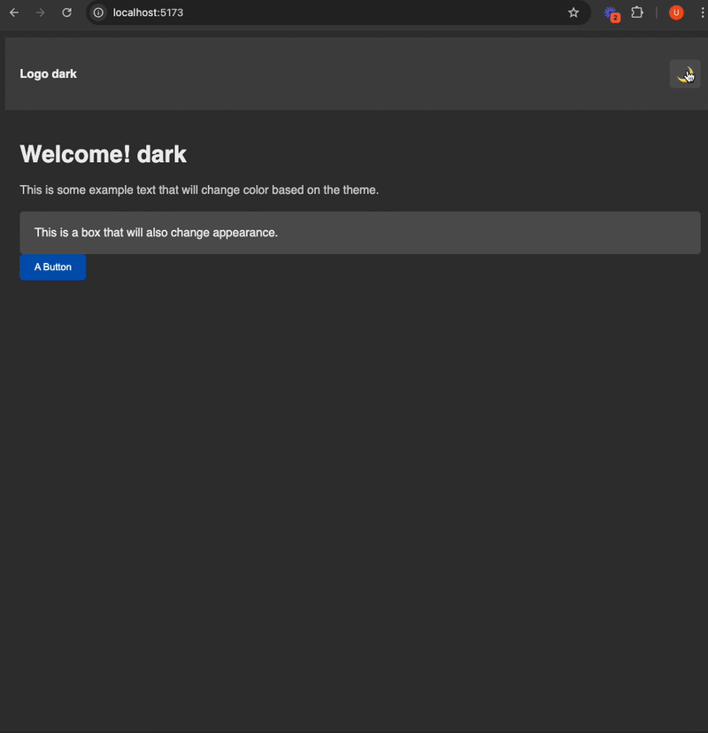

# React Context API Tutorial

This repository contains the code for a step-by-step tutorial on how to use the React Context API for state management.

## What is this tutorial about?

This tutorial guides you through the process of:

* Understanding the basic concepts of the React Context API.
* Creating a context provider.
* Consuming context values in components.
* Updating context values.
* Using `useContext` and `useReducer` (if applicable) for more complex state management.

## Prerequisites

Before you begin, you should have:

* Basic knowledge of React and JavaScript.
* Node.js and npm (or yarn) installed.

## Getting Started

1.  **Clone the repository:**

    ```bash
    git clone https://github.com/musman92/react-context-app.git
    cd react-context-app
    ```

2.  **Install dependencies:**

    ```bash
    npm install  # or yarn install
    ```

3.  **Run the application:**

    ```bash
    npm run dev # or yarn dev
    ```

    The application will open in your browser.

## Tutorial Structure

The tutorial is structured as follows:

* `src/`: Contains the React application source code.
    * `components/`: Contains the React components.
    * `contexts/`: Contains the context provider and related files.
    * `hooks/`: Contains the hooks and related files.
    * `App.js`: The main application component.
    * `index.js`: The entry point of the application.

(You can add more specific file/folder descriptions here if you have a more complex structure)

## Key Concepts Covered

* `createContext`
* `Context.Provider`
* `useContext`
* Passing values through context.
* Updating context state.

## How to Follow the Tutorial

1.  Start by examining the initial state of the application.
2.  Follow the commit history to see the incremental changes made during the tutorial. Each commit represents a step in the tutorial.
3.  Read the comments in the code for explanations of each step.
4.  Experiment with the code and try modifying it to solidify your understanding.

## Result



## Contributing

If you find any issues or have suggestions for improvement, please feel free to open an issue or submit a pull request.

## Author

Usman - https://github.com/musman92/react-context-app

## License

This project is licensed under the [MIT License] - see the [LICENSE.md](LICENSE.md) file for details. (or whatever license you choose)

## Example of how to add a specific file explanation.

If you have a file called `ThemeContext.js` in your context directory, you could add:

* `context/ThemeContext.js`: Creates the theme context and provider.